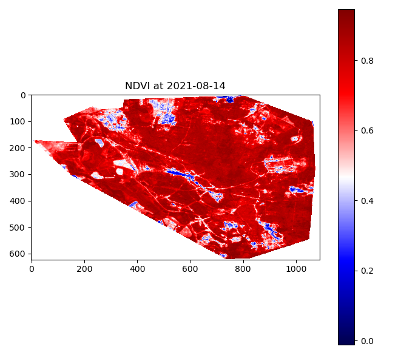

# NDVI Calc Challenge

This programm allows receiving the latest available NDVI scores
from Sentinel-7 when passing a valid geoJSON path or URL.

## Usage:
Run script and specify a local path or url.

`$ ndvicalc --file path/to/file [optional arguments]`

```bash
$ ndvicalc --example

Using example doberitzer_heide.geojson
Latest data found that intersects geometry: 2021-08-14
2021-08-14 Average ndvi 0.763349073955204
```

You can also use the following optional arguments:
arg | action
----|-----
`--example`| Run Doberitzer Heide example
`--full` | Full statistics (max, min, std) 
`--plot` | Render a plot of the given geometry 

## Installation:
```bash
$ git clone https://github.com/marvingabler/ndvi_cli
$ cd ndvi_cli
$ pip install --editable .
```

### Testing
Install the package first, then:
```
$ python setup.py test
```